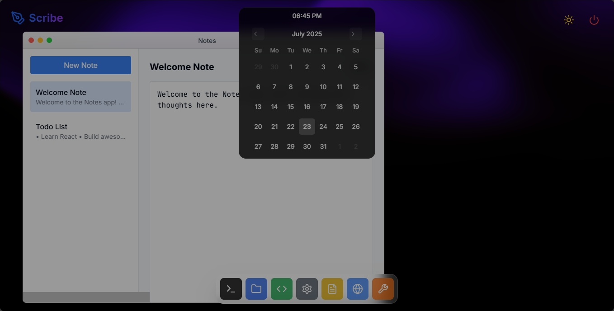
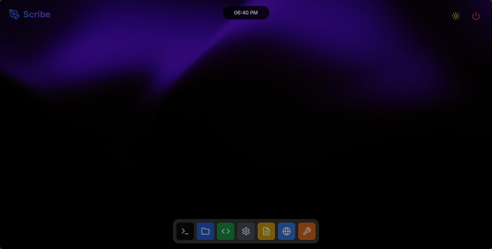
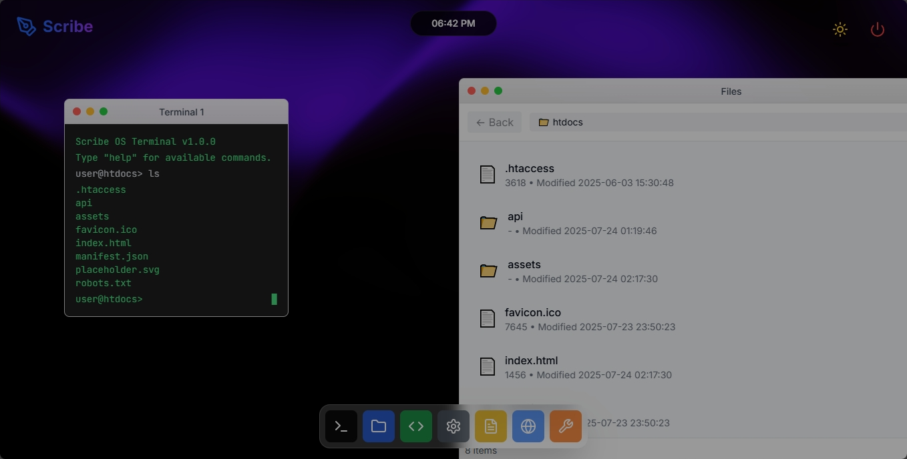
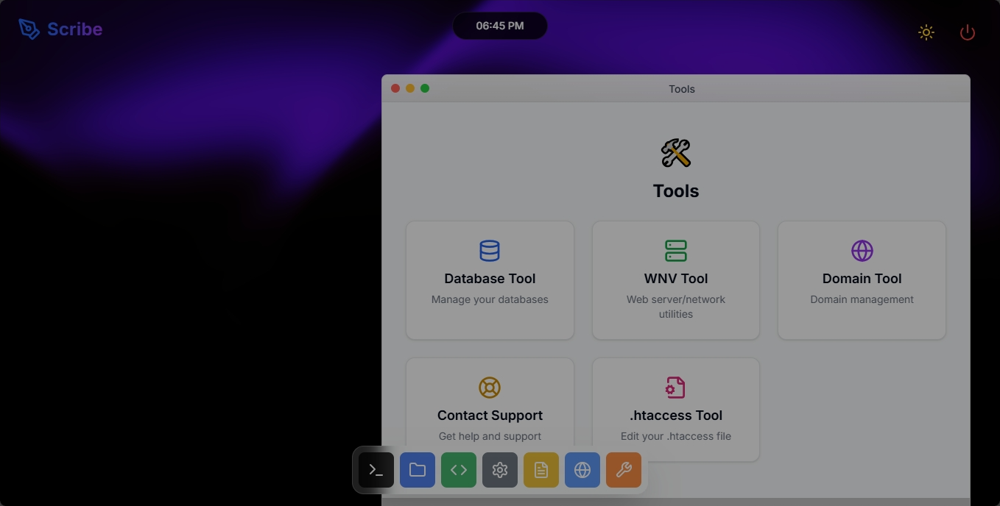

# 🖥️ Scribe OS

Welcome to **Scribe OS** – your playful, modern, and interactive desktop experience, right in your browser! 🚀✨

---

## 🎉 What is Scribe OS?

Scribe OS is a web-based desktop environment that brings the look and feel of a real operating system to your browser. Open apps, move windows, switch themes, and enjoy a delightful, Mac-inspired UI – all powered by React and Tailwind CSS! 🌈

---

## 🛠️ Features

- 🪟 **Draggable Windows** – Move, minimize, and close apps just like a real OS!
- 🌙 **Dark & Light Mode** – Toggle between day and night with a single click.
- 🧰 **Built-in Apps** – Terminal, Notes, Files, Code Editor, Browser, Tools, and more!
- 🏝️ **Dynamic Island** – A fun, animated status bar for notifications and quick actions.
- 🖱️ **Dock** – Launch your favorite apps from a beautiful, animated dock.
- 🎨 **Modern UI** – Smooth animations, glassmorphism, and a Mac-like vibe.

---

## 🖼️ Screenshots

---

## 📦 Tech Stack

- ⚛️ React
- 💨 Tailwind CSS
- 🦄 TypeScript
- 🍞 Vite

---

## 🤝 Contributing

We love contributions! 🫶
- Fork the repo
- Create a new branch
- Make your changes
- Open a pull request

All ideas, bug fixes, and improvements are welcome! 💡

---

## 📝 License

MIT License. Free for everyone! 🥳

---

## 🙌 Credits

Made with ❤️ by the Scribe OS team and open-source contributors.

---

## 📣 Stay Connected

Enjoy your new desktop in the browser! 🖥️✨ 